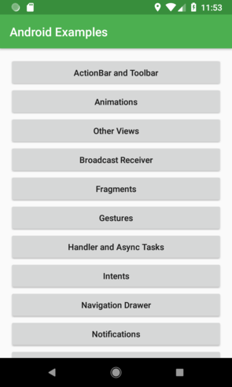
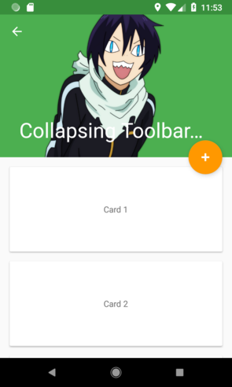
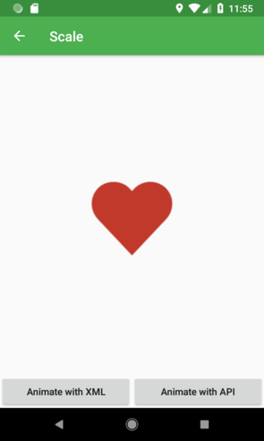
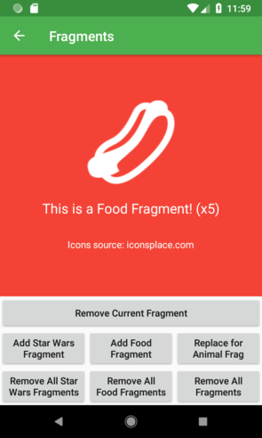
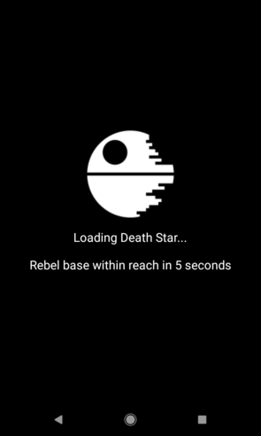
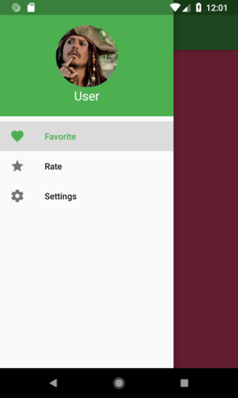
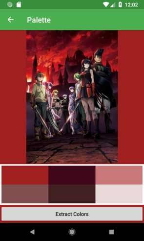
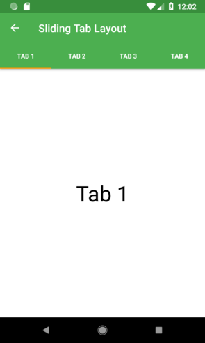

# AndroidExamples
This project brings several Android component's implementations as an easy guide to use.

What you can find here:
- View's Animations
- Activities Transitions
- ViewPager
- BroadcastReceiver
- Draggable View
- Zoomable ImageView
- Floating Action Button
- SearchView
- XML Selectors
- Intents
- Navigation Drawer
- Palette
- Activity Lifecycle
- GridView
- SnackBar
- WebView with SwipeRefreshActivity
- RecyclerView
- ImageSwitcher
- Intro Slider
- Sliding Tab Layout
- Toolbar
- Context Action Bar
- Collapsing Toolbar
- Notifications
- Handlers
- Async Task
- Splash Screen
- Fragments
- SQLite implementation

  
  

  
  

  
  

  
  

